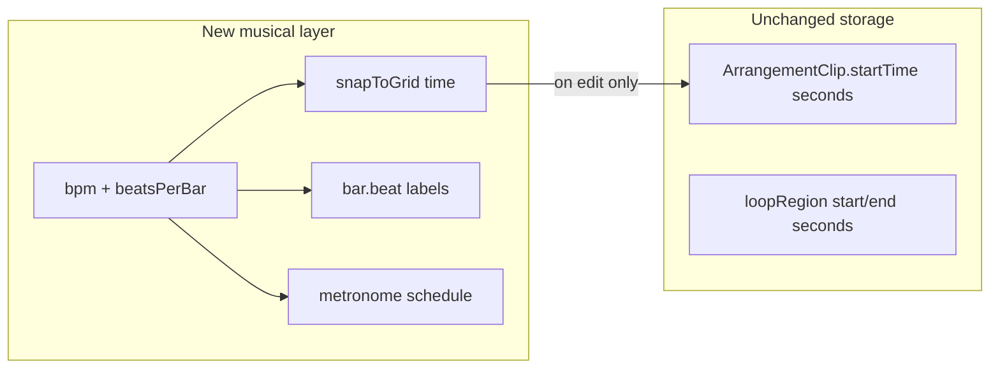

# Musical Time (Phase 1)

## Goal

Turn the arrangement from a **seconds timeline** into a **beat-aware** editor without rewriting playback or clip storage. Clips keep `startTime` in seconds; BPM only drives ruler labels, grid lines, snap, and metronome clicks.



## Data model

Extend `[apps/web/src/lib/types.ts](apps/web/src/lib/types.ts)` `ArrangementState` with optional musical settings (backward-compatible; no version bump required):

```ts
export type SnapDivision = 4 | 8 | 16;

export type MusicalTimeSettings = {
  bpm: number; // default 90, clamp 40–240
  beatsPerBar: number; // default 4 (4/4 only in v1 UI)
  snapEnabled: boolean; // default true
  snapDivision: SnapDivision; // default 16 (16th notes)
  metronomeEnabled: boolean; // default false
};

// arrangement: { lanes, laneRowHeight, loopRegion?, musicalTime? }
```

Defaults applied in `[apps/web/src/lib/sessionPersistence.ts](apps/web/src/lib/sessionPersistence.ts)` `parseV3` when `musicalTime` is missing (existing projects load at 90 BPM / 4/4).

## New module: `lib/musicalTime.ts`

Pure conversion + snap helpers (no React):

| Function                                     | Purpose                                        |
| -------------------------------------------- | ---------------------------------------------- |
| `secondsPerBeat(bpm)`                        | `60 / bpm`                                     |
| `secondsPerBar(bpm, beatsPerBar)`            | beat × bar length                              |
| `snapTime(seconds, settings)`                | round to nearest grid step from `snapDivision` |
| `timeToBarBeat(seconds, bpm, beatsPerBar)`   | `{ bar, beat, tick }` for ruler labels         |
| `barBeatToTime(bar, beat, bpm, beatsPerBar)` | inverse (for future pattern UI)                |
| `beatWidthPx(bpm, pxPerSecond)`              | grid spacing for CSS                           |
| `clampBpm`, `defaultMusicalTime()`           | validation                                     |

**BPM change behavior (your choice):** clips are **not** moved when BPM changes; only the grid/ruler/metronome reinterpret the same second positions.

## Session state + persistence

In `[apps/web/src/hooks/useSessionState.ts](apps/web/src/hooks/useSessionState.ts)`:

- Add reducer action `setMusicalTime` (partial patch merge into `arrangement.musicalTime`).
- Export `setMusicalTime` from the hook (same pattern as `setLoopRegion`).

Wire through `[apps/web/src/App.tsx](apps/web/src/App.tsx)` into `ArrangementSection`.

## Snap integration (edit paths only)

Apply `snapTime()` when `snapEnabled` is true, **before** existing clamp/overlap logic:

| Entry point               | File                                                                                                |
| ------------------------- | --------------------------------------------------------------------------------------------------- |
| Free-lane click placement | `[ArrangementLaneStrip.tsx](apps/web/src/components/ArrangementLaneStrip.tsx)` `handleStripClick`   |
| Clip drag                 | same file `handleClipPointerMove` / final position                                                  |
| Chop drag-drop            | same file `handleDrop`                                                                              |
| Double-click pad → lane   | `[App.tsx](apps/web/src/App.tsx)` `handlePadDoubleClick` (snap `playheadTime`)                      |
| `addClipAt` reducer       | `[useSessionState.ts](apps/web/src/hooks/useSessionState.ts)` `addClipAt` case (central safety net) |
| `moveClip` reducer        | same file `moveClip` case                                                                           |

Clamped lanes (`addClip` append) are unchanged—order-based, not time-based.

Optional v1 polish: snap loop region handles in `[ArrangementLoopRegion.tsx](apps/web/src/components/ArrangementLoopRegion.tsx)` to bar boundaries when snap is on.

## Timeline UI

### Ruler (`[ArrangementTimelineRuler.tsx](apps/web/src/components/ArrangementTimelineRuler.tsx)`)

- Accept `musicalTime` + `pxPerSecond`.
- Replace second-based `rulerTickInterval` ticks with **bar lines** (labels `1`, `2`, `3`…) and **beat subdivisions** (lighter ticks).
- Keep seek/loop-select behavior; snap seek time when snap enabled.

### Grid on lanes (`[ArrangementLaneStrip.tsx](apps/web/src/components/ArrangementLaneStrip.tsx)` + CSS)

- Overlay or background `repeating-linear-gradient` on `.arrangement-clip-strip` using `beatWidthPx`.
- Stronger line every `beatsPerBar` beats (bar boundary).

### Transport controls (`[ArrangementSection.tsx](apps/web/src/components/ArrangementSection.tsx)` header)

New control group beside existing transport/zoom:

- **BPM** number input (40–240)
- **SNAP** toggle
- **GRID** selector: `1/4` · `1/8` · `1/16`
- **CLICK** metronome toggle

Persist all via `setMusicalTime`.

## Metronome

Extend `[useArrangementPlayer.ts](apps/web/src/hooks/useArrangementPlayer.ts)`:

- Accept `musicalTime` in params.
- When `metronomeEnabled` and playing, schedule short click sounds (oscillator or noise burst via existing `AudioContext`) on beat boundaries inside the existing lookahead scheduler (`LOOKAHEAD_SECONDS`).
- Accent beat 1 of each bar (slightly louder/higher pitch).
- Respect loop region bounds (clicks only within active loop when loop enabled).
- No metronome during pad-only preview (sample mode)—arrangement transport only.

## What is explicitly out of scope (Phase 2)

- **Record pads → timeline** (needs musical time first; separate follow-up)
- Beat-based clip storage / BPM retiming of existing clips
- Time signatures other than 4/4 in UI (field exists; UI fixed to 4)
- Swing / groove offset
- MIDI clock sync

## Files to touch (summary)

| Area         | Files                                                                                              |
| ------------ | -------------------------------------------------------------------------------------------------- |
| Types + math | `types.ts`, **new** `musicalTime.ts`                                                               |
| State        | `useSessionState.ts`, `sessionPersistence.ts`                                                      |
| Snap + grid  | `ArrangementLaneStrip.tsx`, `ArrangementTimelineRuler.tsx`, `ArrangementLoopRegion.tsx` (optional) |
| Controls     | `ArrangementSection.tsx`, `App.tsx`                                                                |
| Audio        | `useArrangementPlayer.ts`                                                                          |
| Styles       | `index.css` (grid lines, transport controls)                                                       |

## Test plan (manual)

1. Load project with existing clips — defaults to 90 BPM, clips unchanged.
2. ARRANGE tab: ruler shows bars/beats; grid visible on lanes.
3. Place/drag clip in free lane with snap on — lands on 16th grid; toggle snap off — free placement.
4. Change BPM — clips stay at same seconds; grid spacing/labels update.
5. Enable CLICK, play arrangement — hear beats; beat 1 accented.
6. Reload page — BPM/snap/metronome settings restored.
7. `npm run typecheck` passes.
